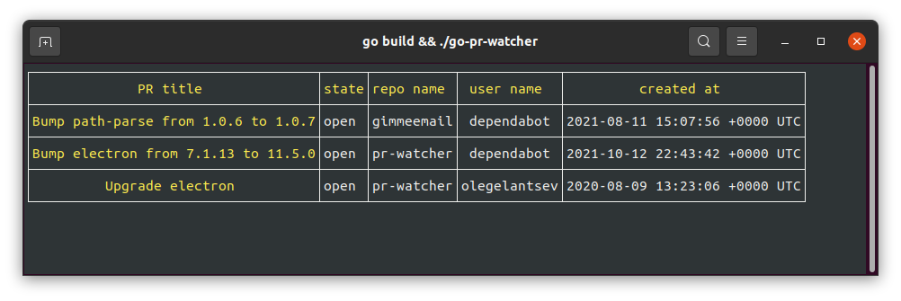

# go-pr-watcher

[](https://github.com/olegelantsev/go-pr-watcher/actions/workflows/go.yml)

---

Shows open pull requests on configured GitHub repositories.



## Getting started

1. Create GitHub personal token with read permissions
2. Create `config.yaml` with repositories map

```yaml
repos:
  olegelantsev: # repo owner
    - gimmeemail # repo name
    - pr-watcher
```
